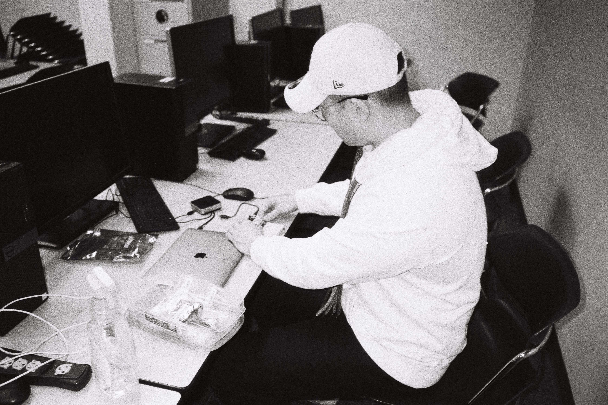

<!--  -->

### Hi, I am Matt Tsai 👋

<!--   -->

 

- <i>Currently:</i> BSc CS Student at Simon Fraser University. Software Engineer at Expo-growth Marketing Corp.
- <i>Previously:</i> Database/Middleware Admin at BC Liquor Distribution Branch.

<h2>👀 Stats</h2>

<!--   

    <b><em>Now listening to:</em></b>  
    
  
 -->
  
  

  <b><em>GitHub Stats:</em></b>  
       
  <!-- <b><em>Programming activity (Last 7 days):</em></b>  
    
  
 -->

<h2>🔭 I’m currently working on </h2>

- Customer Service B2B Program with OpenAI ChatGpt

<h2> 🌱 I’m currently learning  </h2>

- LLM Multi-assistants
- AWS Certification
- Python backend

<!--
**asd881018/asd881018** is a ✨ _special_ ✨ repository because its `README.md` (this file) appears on your GitHub profile.

Here are some ideas to get you started:

- 🔭 I’m currently working on ...
- 🌱 I’m currently learning ...
- 👯 I’m looking to collaborate on ...
- 🤔 I’m looking for help with ...
- 💬 Ask me about ...
- 📫 How to reach me: ...
- 😄 Pronouns: ...
- ⚡ Fun fact: ...
-->
